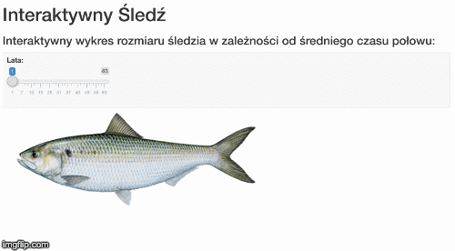

```{r setup, include=FALSE}
knitr::opts_chunk$set(echo = TRUE)
library(dplyr)

#install.packages("ggcorrplot") # Tylko przy 1szym odpaleniu
# install.packages("caret", dependencies = c("Depends", "Suggests"))
library(ggcorrplot)
library(imager)
library(caret)
library(varhandle)
```

## Wstępna analiza danych

##### Wczytanie danych oraz określenie rozmiaru:
```{r dplyr}
fileName = "data/sledzie.csv"
herrings = read.csv(fileName, header = TRUE, sep = ",", dec = ".")
dimentions <- dim(herrings)
dimentions
```
Mamy do czynienia z danymi mającymi 16 zmiennych oraz 52582 przypadków do analizy.

##### Wypisanie nazw kolumn oraz pierwszego wiersza:
```{r}
head(herrings, n=1)
```
Widzimy, że z powodu braku nazwy pierwszej kolumny, została ona zastąpiona znakiem X. Akceptujemy to uzupełnienie pamiętając, aby w przyszłości odwoływać się właśnie do tego znaku.

##### Zamiana znaku "?" reprezentującego pustą wartość na NA:
```{r}
#herrings <- head(herrings, 6)
herrings[herrings == "?"] <- NA
```

##### Sprawdzenie ile jest pustych wartości w każdej kolumnie:
```{r}
countNa <- sapply(herrings, function(x) sum(is.na(x)))
countNa
```

##### Sprawdzenie ile jest pustych wartości razem:
```{r}
sumCountNa <- sum(countNa)
sumCountNa
```

##### Sprawdzenie ile jest wierszy z pustymi wartościami. Wzięliśy pod uwagę tylko prawdopodobne kolumny:
```{r}
countBlackRows <- function(data) {
  blankRows <- data %>% filter(is.na(cfin1) | is.na(cfin2) | is.na(chel1) | is.na(chel2) | is.na(lcop1) | is.na(lcop2) | is.na(sst))
  blankRowsNumber <- count(blankRows)
  blankRowsNumber
}

blankRowsNumber <- countBlackRows(herrings)
blankRowsNumber
```
Tym razem Wyszło nam mniej niż w przypadku zsumowania wszytkich zer. Różnica ta wynika z tego, że niektóre wiersze mają więcej pustych wartości niż jedną.

##### Sprawdzenie ile procent całości zajumją wiesze z pustymi wartościami:
```{r}
percentage <- blankRowsNumber/dimentions[1] * 100
round(percentage, 2)
```
Na podstaiwe powyższych obserwacji, zdecydowaliśmy się nie usuwać wierszy z pustymi wartościami, ponieważ usuniemy wtedy aż 19.2% całości danych. Taka ilość usuniętych danych na pewno wpłynęła by na wynik analizy zbioru. 

Ponieważ wartości z kolumn z ubytkami powtarzają się wielokrotnie, postanowiliśmy zastosować prostą technikę, polegającą na zastąpieniu brakujących danych, wartościami sąsiednimi.

##### Zastąpienie ubytków w danych sąsiednią wartością:
```{r}
completeData <- herrings %>% mutate(
  cfin1 = case_when((is.na(cfin1) & !is.na(lag(cfin1))) ~ lag(cfin1), is.na(cfin1) ~ lead(cfin1), TRUE ~ cfin1),
  cfin2 = case_when((is.na(cfin2) & !is.na(lag(cfin2))) ~ lag(cfin2), is.na(cfin2) ~ lead(cfin2), TRUE ~ cfin2),
  chel1 = case_when((is.na(chel1) & !is.na(lag(chel1))) ~ lag(chel1), is.na(chel1) ~ lead(chel1), TRUE ~ chel1),
  chel2 = case_when((is.na(chel2) & !is.na(lag(chel2))) ~ lag(chel2), is.na(chel2) ~ lead(chel2), TRUE ~ chel2),
  lcop1 = case_when((is.na(lcop1) & !is.na(lag(lcop1))) ~ lag(lcop1), is.na(lcop1) ~ lead(lcop1), TRUE ~ lcop1),
  lcop2 = case_when((is.na(lcop2) & !is.na(lag(lcop2))) ~ lag(lcop2), is.na(lcop2) ~ lead(lcop2), TRUE ~ lcop2),
  sst = case_when((is.na(sst) & !is.na(lag(sst))) ~ lag(sst), is.na(sst) ~ lead(sst), TRUE ~ sst)
)


blankRowsNumber <- countBlackRows(completeData)
blankRowsNumber
```
Widzimy, że zastąpienie wartości uzupełniło nam większość danych, ale nadal mamy 9 komórek bez wartości. Taką liczbę możemy już spokojnie usunąć.

##### Usunięcie pozostałych wierszy:
```{r}
completeData <- completeData %>% filter_all(all_vars(!is.na(.)))

blankRowsNumber <- countBlackRows(completeData)
blankRowsNumber
```
Teraz już mamy kompletne dane, bez pustych wartości. Możemy zatem kontynuaować przetwarzanie.

###### Zauważyliśmy, że większość danych w ramach jednego łowiska są identyczne, więc pogrupowaliśmy je po tych danych:
```{r}
groupedData <- completeData %>% group_by(cfin1, cfin2, chel1, chel2, lcop1, lcop2, fbar, recr, cumf, totaln, sst, sal, nao)
groupedData
```
W taki sposób uzyskaliśmy pogrupowane dane do 557 wierszy, liczba ta powinna odpowiadać iości łowisk.

##### Funkcja mapująca indeks na rok:
```{r}
mapIndexToYear <- function(index) {
  maxIndex <- dim(herrings)[1]
  
  year = (index*60)/maxIndex
  as.integer(year)
  
}

mapIndexToYear(40000)
```
##### Wykres zależności rozmiaru śledzia w analizowanych latach:
```{r}
#completeData[["X"]]
plot(mapIndexToYear(groupedData[["X"]]), groupedData[["length"]], cex = 0.5, main = "Wykres zależności rozmiaru śledzia w analizowanych latach", xlab = "Kolejne lata", ylab = "Rozmiar śledzia")
```

Lata przedstawione na wykresie są wyłuskane przy założeniu równego rozkładu łowisk w każdym roku.

##### Przedstawienie wyniku interaktywnego wykresu rozmiaru śledzia:



## Rozkład wartości kolumn

##### Stworzenie wykresu rozkładu dla każdej ze zmiennych:

```{r}
legend <- c(
    "indeks obserwacji - X",
    "length: długość złowionego śledzia [cm]",
    "cfin1: dostępność planktonu [zagęszczenie Calanus finmarchicus gat. 1]",
    "cfin2: dostępność planktonu [zagęszczenie Calanus finmarchicus gat. 2]",
    "chel1: dostępność planktonu [zagęszczenie Calanus helgolandicus gat. 1]",
    "chel2: dostępność planktonu [zagęszczenie Calanus helgolandicus gat. 2]",
    "lcop1: dostępność planktonu [zagęszczenie widłonogów gat. 1]",
    "lcop2: dostępność planktonu [zagęszczenie widłonogów gat. 2]",
    "fbar: natężenie połowów w regionie [ułamek pozostawionego narybku]",
    "recr: roczny narybek [liczba śledzi]",
    "cumf: łączne roczne natężenie połowów w regionie [ułamek pozostawionego narybku]",
    "totaln: łączna liczba ryb złowionych w ramach połowu [liczba śledzi]",
    "sst: temperatura przy powierzchni wody [°C]",
    "sal: poziom zasolenia wody [Knudsen ppt]",
    "xmonth: miesiąc połowu [numer miesiąca]",
    "nao: oscylacja północnoatlantycka [mb]")

names <- names(groupedData)
df <- sapply(groupedData[, c(1:16)], as.numeric)

for (x in c(1:4)){
  layout(matrix(c(1,2,3,4), 2, 2, byrow = TRUE))
  for (i in c(1:4)) {
    hist(df[,4*x + i - 4],
    main= paste(" ",legend[4*x + i - 4]),
    cex.main = 0.62,
    xlab=names[4*x + i - 4],
    ylab = "% Liczności",
    col="darkmagenta",
    freq=FALSE
    )
  }
}

```

Niektóre rozkłady danych z jednej kategorii (kolumny) przypominają rozkład normlany mi. dane: długości śledzia, poziomu zasolenia wody czy miesiąca połowu.

##### TODO skomentowac najdziwniejsze anomalie na wykresach

## Korelacja pomiędzy zmiennym

Ważnym czynnikiem jest także zbadanie korelacji pomiędzy poszczególnym,i zmiennymi

```{r }
res <- round(cor(df),2)
print(ggcorrplot(res, method = "circle"))
```
Powyższa macierz korelacji przedstawia zależności pomiędzy każdą parą zmiennych. Przyjęty próg ważności obserwacji wynosi < -0.4 oraz > 0.4.
Przefiltrujmy macierz i zobaczmy które z par należą do przedziału ważności.

##### Filtracja głównie skorelowanych zmiennych pozyskanych z macierzy korelacji:

```{r}
pos_cor <- c(sort(unique(res[res > 0.4 & res != 1.0])))
neg_cor <- c(sort(unique(res[res < -0.4 & res != 1.0])))
```
Znalezione wartości korelacji pozytywnej przekraczające próg:
```{r}
pos_cor
```
Znalezione wartości korelacji negatywnej przekraczające próg:
```{r}
neg_cor
```

Chcielbyśmy zobaczyć które pary zmiennych kryją się za odpowiednio wysokimi(niskimi) wartościami korelacji. W tym celu tworzymy funkcję która znajdzie szukaną parę.

```{r}
show_pairs <- function(cor) {
  pairs <- matrix(ncol = 2)
  for (i in cor){
    a = which(res==i, arr.ind=TRUE)
    pairs = rbind(pairs, c(rownames(a)[1],rownames(a)[2]))
  }
  pairs = pairs[-1,]
  return(pairs)
}

positive <- show_pairs(pos_cor)
negative <- show_pairs(neg_cor)
```

Znalezione pary pozytywnej korelacji:
```{r}
positive
```
Znalezione pary negatywnej korelacji:
```{r}
negative
```

##### Analiza skorelowanych elementów:

Pomijamy autokorelację zmiennych (widoczną na przekątnej jako czerwone koło).

##### Z wykresu możemy zaobserwować wyróżniające się pary dodatniej korelacji:
1. Wsp. kor: 0.40 cfin1:cfin2 (dostępność planktonu [zagęszczenie Calanus finmarchicus gat. 1] -  dostępność planktonu [zagęszczenie Calanus finmarchicus gat. 2])
2. Wsp. kor: 0.41 nao:X (oscylacja północnoatlantycka - indeks obserwacji)
3. Wsp. kor: 0.52 nao:sst (oscylacja północnoatlantycka - temperatura przy powierzchni wody)
4. Wsp. kor: 0.64 lcop1:chel1 (dostępność planktonu [zagęszczenie widłonogów gat. 1 - zagęszczenie Calanus helgolandicus gat. 1]
5. Wsp. kor: 0.69 lcop2:chel2 (dostępność planktonu [zagęszczenie widłonogów gat. 2 - zagęszczenie Calanus helgolandicus gat. 2]
6. Wsp. kor: 0.81 cumf:fbar (łączne roczne natężenie połowów w regionie [ułamek pozostawionego narybku] - natężenie połowów w regionie [ułamek pozostawionego narybku])

##### Ocena korelacji:
1. Dostępność planktonu Calanus finmarchicus gat 1 jest zależna od planktonu tego samego rodzaju planktonu gat. 2.
2. Wzmożona oscylacja północnoatlantycka jest powiązana ze wzrostem indeksu obserwacji. Korzystając z wiedzy, że obserwacje posortowane są chronologicznie można stwierdzić że oscylacja rośnie wraz z czasem. 
3. Wzmożona oscylacja północnoatlantycka jest powiązana ze wzrostem temperatury wody przy powierzchni.
4. Dostępność planktonu widłonogów gat 1. jest zależna od występnowania helgolandicus gat. 1. Gatunki te często występują razem. 
5. Analogicznie jak pkt. 4 w przypadku gatunku nr 2 obu planktonów.
6. Natężenie regionalne jest składową całościowego natężenia stąd wysoka korelacja jest czymś spodziewanym.

##### Wyróżniające się pary ujemnej korelacji:
7. Wsp. kor: -0.42 sst:length (temperatura przy powierzchni wody - długość złowionego śledzia)
8. Wsp. kor: -0.50 totaln:fbar (łączna liczba ryb złowionych w ramach połowu - natężenie połowów w regionie)
9. Wsp. kor: -0.70 totaln:cumf (łączna liczba ryb złowionych w ramach połowu - łączne roczne natężenie połowów w regionie [ułamek pozostawionego narybku])

###### Ocena korelacji:
7. Im temperatura wody jest cieplejsza tym wyławiany śledź jest mniejszy. Analogicznie gdy tempeatura wody spada, średnia długość śledzia rośnie.
8. Im większe regionalne natężenie połowów w regionie, tym mniejsza jest liczba ryb łowionych w ramach połowu.
9. Im większe całkowite natężenie połowów w regionie, tym mniejsza jest liczba ryb łowionych w ramach połowu.
 
##### Filtracja zmiennych znacząco skorelowanych:

Można sprawdzić także jak wyglądają nieco mniej skorelowane wartości np. w przedziale (-0.4:-0.3) or (0.3:0.4):
```{r}
pos_cor <- c(sort(unique(res[res > 0.3 & res < 0.4])))
neg_cor <- c(sort(unique(res[res < -0.3 & res > -0.4])))

softly_pos <- show_pairs(pos_cor)
softly_neg <- show_pairs(neg_cor)
```

Znalezione pary pozytywnej korelacji:
```{r}
softly_pos
```
Znalezione pary negatywnej korelacji:
```{r}
softly_neg
```

##### Ocena korelacji:

Przeglądając zbiór nieco mniej skorelowanych zmiennych można zauważyć, że średnia temperatura wody rośnie z czasem. Z drugiej strony liczba wyławianych śledzi jak i ich długość maleje z czasem. Ponadto rosnąca oscylacja atlantycka ma wpływ na zmniejszenie się zagęszczenia planktonu widłonogów gat. 2, Calanus helgolandicus gat. 2 oraz liczby wyławianych śledzi.

## Obserwacje po łącznej analizie rozkładu danych i macierzy korelacji
```{r}
library(htmlwidgets)
library(magrittr)
library(dygraphs)
library(webshot)

groupedData <- groupedData %>% mutate(mean_glony = mean(c(cfin1, cfin2, chel1, chel2, lcop1, lcop2)))
groupedData <- unfactor(groupedData)
 
make_sizes <- function(name){
  herr_vec <- groupedData[[name]]
  max <- dim(herrings)[1]
  average <- as.integer(max/60)
  sizes <- c()
  sum  <- 0
 
  for (index in 1:length(herr_vec) ) {
    sum <- sum + herr_vec[index]
   
    if (index %% average == 0) {
      mean <- sum/60
      sizes <- c(sizes, mean)
      sum  <- 0
    }
  }
  return(sizes)
}
 
normalize <- function(x){
    ww = ((x - min(x)) / (max(x) - min(x)))
    return(ww)
}
 
make_df <- function(x1,x2) {
  return(data.frame(
  time= c(seq(0,58,1), 60),
  value=normalize(make_sizes(x1)),
  value2=normalize(make_sizes(x2))
 
  ))
}
 
make_df_3v <- function(x1,x2,x3) {
  return(data.frame(
    time= c(seq(0,58,1), 60),
    value=normalize(make_sizes(x1)),
    value2=normalize(make_sizes(x2)),
    value3=normalize(make_sizes(x3))
   
  ))
}
 
data1 <- make_df("length","sst")
data2 <- make_df("length","nao")
data33 <- make_df("nao","sst")
data3 <- make_df("totaln","length")
data4 <- make_df("totaln","fbar")
data5 <- make_df("totaln","cumf")
data7 <- make_df("length","fbar")
data8 <- make_df("nao","mean_glony")
 
p1 <- dygraph(data1, main = "Porównanie dlugosci śledzia do temperatury wody", ylab = "Znormalizowana wartość") %>% dyOptions(fillGraph = TRUE, fillAlpha = 0.4) %>% dySeries("value", label = "Długość śledzia") %>%
  dySeries("value2", label = "Temp. wody")
#p1
 
p2 <- dygraph(data2, main = "Porównanie dlugosci śledzia do oscylacji północnoatlantyckiej", ylab = "Znormalizowana wartość") %>% dyOptions(fillGraph = TRUE, fillAlpha = 0.4) %>% dySeries("value", label = "Długość śledzia") %>%
  dySeries("value2", label = "Oscylacja północnoatlantycka")
#p2
 
p3 <- dygraph(data33, main = "Oscylacja polnoconatlantycka a temperatura wody", ylab = "Znormalizowana wartość") %>% dyOptions(fillGraph = TRUE, fillAlpha = 0.4) %>% dySeries("value", label = "Oscylacja północnoatlantycka") %>%
  dySeries("value2", label = "Temp. wody przy powierzchni")
#p3
 
p4 <- dygraph(data3, main = "Porównanie liczby złowionych śledzi do ich długości", ylab = "Znormalizowana wartość") %>% dyOptions(fillGraph = TRUE, fillAlpha = 0.4) %>% dySeries("value", label = "Liczba złowionych śledzi") %>%
  dySeries("value2", label = "Długość śledzi")
#p4
 
p5 <- dygraph(data4, main = "Porównanie liczby złowionych śledzi do łącznego rocznego procentu zostawionego narybku", ylab = "Znormalizowana wartość") %>% dyOptions(fillGraph = TRUE, fillAlpha = 0.8) %>% dySeries("value", label = "Liczba złowionych śledzi ") %>%
  dySeries("value2", label = "Łączny roczny procent zostawionego narybku") #%>% dySeries("value3", label = "Długość śledzia")
#p5
 
p6 <- dygraph(data5, main = "Porównanie liczby złowionych śledzi do regionalnego rocznego procentu zostawionego narybku", ylab = "Znormalizowana wartość") %>% dyOptions(fillGraph = TRUE, fillAlpha = 0.4) %>% dySeries("value", label = "Liczba złowionych śledzi ") %>%
  dySeries("value2", label = "Regionalny procent zostawionego narybku")
#p6
 
p7 <- dygraph(data7, main = "Porównanie dlugosci śledzia do procentu pozostawionej populacji śledzi", ylab = "Znormalizowana wartość") %>% dyOptions(fillGraph = TRUE, fillAlpha = 0.4) %>% dySeries("value", label = "Długość śledzia") %>%
  dySeries("value2", label = "Procent pozostawionej populacji śledzi [%]")
#p7
 
p8 <- dygraph(data8, main = "Oscylacja polnoconatlantycka a średnie łączne zagęszczenie glonów", ylab = "Znormalizowana wartość") %>% dyOptions(fillGraph = TRUE, fillAlpha = 0.4) %>% dySeries("value", label = "Oscylacja północnoatlantycka") %>%
  dySeries("value2", label = "Średnie zagęszczenie glonów")
#p8
 
names <- c("p1.png","p2.png","p3.png","p4.png","p5.png","p6.png","p7.png","p8.png")
 
width<- 1080
height <- 610
```
Wszystkie prezentowane przez nas poniższe wykresy są ustandaryzowane na osi OY, natomiast oś OX symbolizuje lata (badania trwały 60 lat).

Temperatura wody + oscylacja północnoatlantycka - Jak pokazują wykresy 1 i 2 źródłami malejącego rozmiaru śledzia jest wzrost temperatura wody która zawiera się w oscylacji północnoatlantyckiej, która także ma tendencję wzrostową . Zjawisko to determinuje zmiany ciśnienia, temperatury jak i prądów morskich. Zmiany tak wielu czynników natury mogą mieć bezpośredni wpływ na aktywność śledzi (np. mogą być zmuszone do częstych migracji lub mieć kłopoty ze znalezieniem pożywienia (o czym w punkcie 3), ponieważ wzrost oscylacji narusza łańcuch pokarmowy). Oscylacja jak i temperatura są bardzo zależne od siebie (wykres 3)

```{r}
saveWidget(p1, "temp.html", selfcontained = FALSE)
webshot("temp.html", file = names[1],
        cliprect = c(10,30,width+50,height+50)
        ,vwidth = width, vheight = height )
 

```
```{r}
saveWidget(p2, "temp.html", selfcontained = FALSE)
webshot("temp.html", file = names[2],
        cliprect = c(10,30,width+50,height+50)
        ,vwidth = width, vheight = height )
```

```{r}
saveWidget(p3, "temp.html", selfcontained = FALSE)
webshot("temp.html", file = names[3],
        cliprect = c(10,30,width+50,height+50)
        ,vwidth = width, vheight = height )
```

Choć nie wynika to z macierzy korelacji, posiłkując się wiedzą dziedzinową uważamy, że im większa jest różnica pomiędzy narybkiem a procentem zostawianych ryb, tym społeczeństwo w akwenie będzie młodsze, czyli często mniejsze pod względem długości osobnika. Jak pokazuje wykres 4 w momencie mniejszych połowów (lata 20-40) ryby były większe. Nie jest to jednak przekonujące ponieważ wahania długości wydają się momentami niezależne od wartości narybku (lata 0-20). Jeśli dodamy natomiast liczbę łowionych ryb i pozostawiany narybek na jednym wykresie (wyk. 5 oraz wyk. 6) możemy zaobserwować, że zawsze gdy procent łowionych ryb przewyższał znormalizowany stosunek pozostawionych ryb, kolejne lata były burzliwe i musiały być przeznaczone na odbudowywanie populacji. Prowadzi nas to do wyk. 7 który pokazuje że długość śledzi jest bardzo skorelowana z pozostawianym narybkiem. Często by wyrobić normy po latach mniejszych połowów, łowi się więcej ryb niż powinno, co może skutkować zakłóceniem reprodukcji śledzia. Po latach obfitych łowów by zrealizować zapotrzebowanie łowi się małe ryby, które już pozostały w akwenie. Problemem może być zatem zbyt długi okres ‘rabunkowy’, a zbyt ograniczony okres reprodukowania gatunku. W związku z tym łowione ryby są zwyczajnie mniejsze.

```{r}
saveWidget(p4, "temp.html", selfcontained = FALSE)
webshot("temp.html", file = names[4],
        cliprect = c(10,30,width+50,height+50)
        ,vwidth = width, vheight = height )
```

```{r}
saveWidget(p5, "temp.html", selfcontained = FALSE)
webshot("temp.html", file = names[5],
        cliprect = c(10,30,width+50,height+50)
        ,vwidth = width, vheight = height )
```

```{r}
saveWidget(p6, "temp.html", selfcontained = FALSE)
webshot("temp.html", file = names[6],
        cliprect = c(10,30,width+50,height+50)
        ,vwidth = width, vheight = height )
```

```{r}
saveWidget(p7, "temp.html", selfcontained = FALSE)
webshot("temp.html", file = names[7],
        cliprect = c(10,30,width+50,height+50)
        ,vwidth = width, vheight = height )
```

3. Kolejnym powodem może być wpływ oscylacji północnoatlantyckiej na zagęszczenie planktonu. Średnie zagęszczenie planktonu jest ujemnie skorelowane z oscylacją. Tylko jeden gatunek planktonu (fin1), jest wśród wymienianych 6-ciu  pozytywnie skorelowany ze wspomnianym zjawiskiem. Pozostałe 5 posiadają z nim ujemną korelację. To sprawia, że ogólna średnia zawartość planktonu spada z czasem. Ryby mając problem ze znalezieniem pożywienia, mogą reagować na tę napotkaną trudność ograniczonym wzrostem ciała. Wykres 8, w latach 35-45 pokazuje wyraźną ujemną korelacje zagęszczenia glonów a temperatury wody. 
```{r}
saveWidget(p8, "temp.html", selfcontained = FALSE)
webshot("temp.html", file = names[8],
        cliprect = c(10,30,width+50,height+50)
        ,vwidth = width, vheight = height )
```

Ważnym wnioskiem po obserwacji macierzy korelacji jest także to, że miesiąc połowu nie jest skorelowany z żadną z wartości. Wzmacnia to niezależność badania.

## Konstrukcja regresora

##### Wyłuskanie tylko kolumny do przewidywania długości oraz sst, który posiada silną negatywną korelację z długością:
```{r}
dataToLearn <- completeData %>% select(length, sst)
head(dataToLearn)
```
Widzimy, że sst nie jest wektorem liczb.

##### Zamieniamy kolumnę sst na wektor liczbowy:
```{r}
countBlackRows2 <- function(data) {
  blankRows <- data %>% filter(is.na(length) | is.na(sst))
  blankRowsNumber <- count(blankRows)
  blankRowsNumber
}

dataToLearn <- unfactor(dataToLearn)
head(dataToLearn)
```

##### Podział zbioru danych na treningowy testowy i treningowy,
```{r}
set.seed(23)
inTraining <- 
    createDataPartition(
        # atrybut do stratyfikacji
        y = dataToLearn$length,
        # procent w zbiorze uczącym
        p = .75,
        # chcemy indeksy a nie listę
        list = FALSE)

training <- dataToLearn[ inTraining,]
testing  <- dataToLearn[-inTraining,]
```
##### Ustawienie parametrów uczenia oraz metody próbkowania na kroswalidację:
```{r}
ctrl <- trainControl(
    # powtórzona ocena krzyżowa
    method = "repeatedcv",
    # liczba podziałów
    number = 2,
    # liczba powtórzeń
    repeats = 5)
```

##### Ustawienie metody uczenia na Random Forrest, oraz jej parametru ntree na 10, oznaczającego liczbę drzew.
```{r warning=F}
fit <- train(length ~ .,
             data = training,
             method = "rf",
             trControl = ctrl,
             # Paramter dla algorytmu uczącego
              ntree = 10
             )

fit
```

##### Ustawienie metody uczenia na Regresję liniową:
```{r}
lm_fit <- train(length ~ .,
                data = training, 
                method = "lm")

lm_fit
```

Do uczenia modelu został użyty parametr najbardziej skolrelowany z długością śledzia, jakim była temperatura powierzchni wody. Jak możemy zauważyć, w odpowiedzi dostajemy miary dopasowania. Interesuje nas miara R^2 i RMSE. R^2 wyjaśnia, w jakim stopniu wariancja jednej zmiennej wyjaśnia wariancję drugiej zmiennej. Jeśli więc R^2 modelu wynosi 0,50, to około połowy zaobserwowanej zmienności można wyjaśnić danymi wejściowymi modelu. Dążymy do jego maksymalizacji. RMSE jest to średnia kwadratowa błędów, będąca pierwiastkiem kwadratowym z błędu średniokwadratowego. Dążymy do jego minimalizacji. 

Jak możemy zauważyć lepiej wypadł model Random Forrest, który osiągnął miary dopasowania na poziomie: RMSE = 1.190593 oraz R^2 = 0.4808247. Regresja liniowa wypadła nieco gorzej osiągając RMSE = 1.475002 oraz R^2 = 0.2035086.