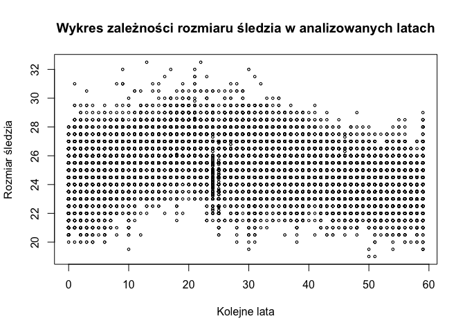

Herringmania
================

## Wstępna analiza danych

##### Wczytanie danych oraz określenie rozmiaru:

``` r
fileName = "data/sledzie.csv"
herrings = read.csv(fileName, header = TRUE, sep = ",", dec = ".")
dimentions <- dim(herrings)
dimentions
```

    ## [1] 52582    16

Mamy do czynienia z danymi mającymi 16 zmiennych oraz 52582 przypadków
do
    analizy.

##### Wypisanie nazw kolumn oraz pierwszego wiersza:

``` r
head(herrings, n=1)
```

    ##   X length   cfin1   cfin2   chel1 chel2   lcop1    lcop2  fbar   recr
    ## 1 0     23 0.02778 0.27785 2.46875     ? 2.54787 26.35881 0.356 482831
    ##        cumf   totaln           sst      sal xmonth nao
    ## 1 0.3059879 267380.8 14.3069330186 35.51234      7 2.8

Widzimy, że z powodu braku nazwy pierwszej kolumny, została ona
zastąpiona znakiem X. Akceptujemy to uzupełnienie pamiętając, aby w
przyszłości odwoływać się właśnie do tego znaku.

##### Zamiana znaku “?” reprezentującego pustą wartość na <NA>:

``` r
#herrings <- head(herrings, 6)
herrings[herrings == "?"] <- NA
```

##### Sprawdzenie ile jest pustych wartości w każdej kolumnie:

``` r
countNa <- sapply(herrings, function(x) sum(is.na(x)))
countNa
```

    ##      X length  cfin1  cfin2  chel1  chel2  lcop1  lcop2   fbar   recr   cumf 
    ##      0      0   1581   1536   1555   1556   1653   1591      0      0      0 
    ## totaln    sst    sal xmonth    nao 
    ##      0   1584      0      0      0

##### Sprawdzenie ile jest pustych wartości razem:

``` r
sumCountNa <- sum(countNa)
sumCountNa
```

    ## [1] 11056

##### Sprawdzenie ile jest wierszy z pustymi wartościami. Wzięliśy pod uwagę tylko prawdopodobne kolumny:

``` r
countBlackRows <- function(data) {
  blankRows <- data %>% filter(is.na(cfin1) | is.na(cfin2) | is.na(chel1) | is.na(chel2) | is.na(lcop1) | is.na(lcop2) | is.na(sst))
  blankRowsNumber <- count(blankRows)
  blankRowsNumber
}

blankRowsNumber <- countBlackRows(herrings)
blankRowsNumber
```

    ## # A tibble: 1 x 1
    ##       n
    ##   <int>
    ## 1 10094

Tym razem Wyszło nam mniej niż w przypadku zsumowania wszytkich zer.
Różnica ta wynika z tego, że niektóre wiersze mają więcej pustych
wartości niż jedną.

##### Sprawdzenie ile procent całości zajumją :

``` r
percentage <- blankRowsNumber/dimentions[1] * 100
round(percentage, 2)
```

    ##      n
    ## 1 19.2

Na podstaiwe powyższych obserwacji, zdecydowaliśmy się nie usuwać
wierszy z pustymi wartościami, ponieważ usuniemy wtedy aż 19.2% całości
danych. Taka ilość usuniętych danych na pewno wpłynęła by na wynik
analizy zbioru.

Ponieważ wartości z kolumn z ubytkami powtarzają się wielokrotnie,
postanowiliśmy zastosować prostą technikę, polegającą na zastąpieniu
brakujących danych, wartościami sąsiednimi.

##### Zastąpienie ubytków w danych sąsiednią wartością:

``` r
completeData <- herrings %>% mutate(
  cfin1 = case_when((is.na(cfin1) & !is.na(lag(cfin1))) ~ lag(cfin1), is.na(cfin1) ~ lead(cfin1), TRUE ~ cfin1),
  cfin2 = case_when((is.na(cfin2) & !is.na(lag(cfin2))) ~ lag(cfin2), is.na(cfin2) ~ lead(cfin2), TRUE ~ cfin2),
  chel1 = case_when((is.na(chel1) & !is.na(lag(chel1))) ~ lag(chel1), is.na(chel1) ~ lead(chel1), TRUE ~ chel1),
  chel2 = case_when((is.na(chel2) & !is.na(lag(chel2))) ~ lag(chel2), is.na(chel2) ~ lead(chel2), TRUE ~ chel2),
  lcop1 = case_when((is.na(lcop1) & !is.na(lag(lcop1))) ~ lag(lcop1), is.na(lcop1) ~ lead(lcop1), TRUE ~ lcop1),
  lcop2 = case_when((is.na(lcop2) & !is.na(lag(lcop2))) ~ lag(lcop2), is.na(lcop2) ~ lead(lcop2), TRUE ~ lcop2),
  sst = case_when((is.na(sst) & !is.na(lag(sst))) ~ lag(sst), is.na(sst) ~ lead(sst), TRUE ~ sst)
)


blankRowsNumber <- countBlackRows(completeData)
blankRowsNumber
```

    ## # A tibble: 1 x 1
    ##       n
    ##   <int>
    ## 1     9

Widzimy, że zastąpienie wartości uzupełniło nam większość danych, ale
nadal mamy 9 komórek bez wartości. Taką liczbę możemy już spokojnie
usunąć.

##### Usunięcie pozostałych wierszy:

``` r
completeData <- completeData %>% filter_all(all_vars(!is.na(.)))

blankRowsNumber <- countBlackRows(completeData)
blankRowsNumber
```

    ## # A tibble: 1 x 1
    ##       n
    ##   <int>
    ## 1     0

Teraz już mamy kompletne dane, bez pustych wartości. Możemy zatem
kontynuaować
przetwarzanie.

###### Zauważyliśmy, że większość danych w ramach jednego łowiska są identyczne, więc pogrupowaliśmy je po tych danych:

``` r
groupedData <- completeData %>% group_by(cfin1, cfin2, chel1, chel2, lcop1, lcop2, fbar, recr, cumf, totaln, sst, sal, nao)
groupedData
```

    ## # A tibble: 52,573 x 16
    ## # Groups:   cfin1, cfin2, chel1, chel2, lcop1, lcop2, fbar, recr, cumf, totaln,
    ## #   sst, sal, nao [557]
    ##        X length cfin1 cfin2 chel1 chel2 lcop1 lcop2  fbar   recr  cumf totaln
    ##    <int>  <dbl> <fct> <fct> <fct> <fct> <fct> <fct> <dbl>  <int> <dbl>  <dbl>
    ##  1     0   23   0.02… 0.27… 2.46… 21.4… 2.54… 26.3… 0.356 482831 0.306 2.67e5
    ##  2     1   22.5 0.02… 0.27… 2.46… 21.4… 2.54… 26.3… 0.356 482831 0.306 2.67e5
    ##  3     2   25   0.02… 0.27… 2.46… 21.4… 2.54… 26.3… 0.356 482831 0.306 2.67e5
    ##  4     3   25.5 0.02… 0.27… 2.46… 21.4… 2.54… 26.3… 0.356 482831 0.306 2.67e5
    ##  5     4   24   0.02… 0.27… 2.46… 21.4… 2.54… 26.3… 0.356 482831 0.306 2.67e5
    ##  6     5   22   0.02… 0.27… 2.46… 21.4… 2.54… 26.3… 0.356 482831 0.306 2.67e5
    ##  7     6   24   0.02… 0.27… 2.46… 21.4… 2.54… 26.3… 0.356 482831 0.306 2.67e5
    ##  8     7   23.5 0.02… 0.27… 2.46… 21.4… 2.54… 26.3… 0.356 482831 0.306 2.67e5
    ##  9     8   22.5 0.02… 0.27… 2.46… 21.4… 2.54… 26.3… 0.356 482831 0.306 2.67e5
    ## 10     9   22.5 0.02… 0.27… 2.46… 21.4… 2.54… 26.3… 0.356 482831 0.306 2.67e5
    ## # … with 52,563 more rows, and 4 more variables: sst <fct>, sal <dbl>,
    ## #   xmonth <int>, nao <dbl>

W taki sposób uzyskaliśmy pogrupowane dane do 557 wierszy, liczba ta
powinna odpowiadać iości łowisk.

##### Funkcja mapująca indeks na rok:

``` r
mapIndexToYear <- function(index) {
  maxIndex <- dim(herrings)[1]
  
  year = (index*60)/maxIndex
  as.integer(year)
  
}

mapIndexToYear(40000)
```

    ## [1] 45

##### Wykres zależności rozmiaru śledzia w analizowanych latach:

``` r
#completeData[["X"]]
plot(mapIndexToYear(groupedData[["X"]]), groupedData[["length"]], cex = 0.5, main = "Wykres zależności rozmiaru śledzia w analizowanych latach", xlab = "Kolejne lata", ylab = "Rozmiar śledzia")
```

<!-- -->

## R Markdown

This is an R Markdown document. Markdown is a simple formatting syntax
for authoring HTML, PDF, and MS Word documents. For more details on
using R Markdown see <http://rmarkdown.rstudio.com>.

When you click the **Knit** button a document will be generated that
includes both content as well as the output of any embedded R code
chunks within the document. You can embed an R code chunk like this:

``` r
MyData <- read.csv(file="sledzie.csv", header=TRUE, sep=",")
```
